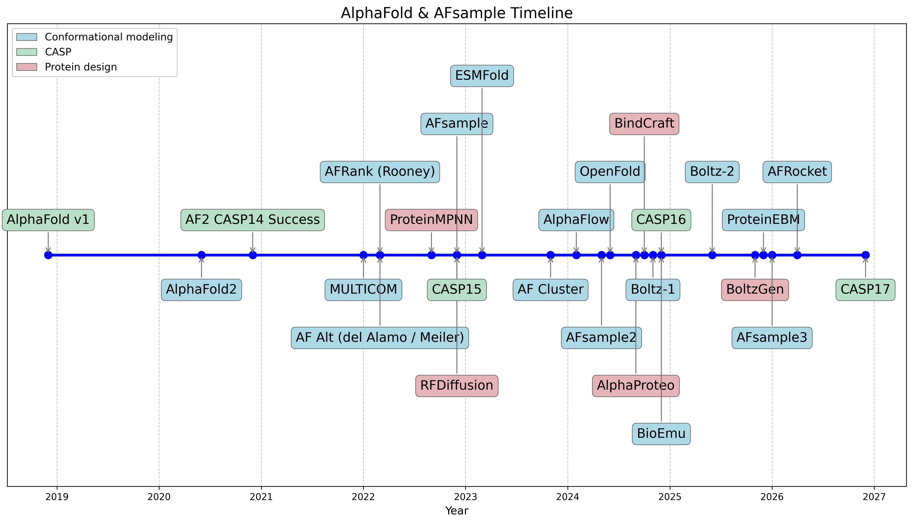

# AlphaFold timeline

This repository holds a small **timeline of AlphaFold-related methods, CASP rounds, and neighboring tools**, built from structured data and rendered with Matplotlib. Event boxes are color-coded (conformational modeling, CASP, protein design); each row in the dataset can include an optional long description for slide-style exports.

## Timeline (overview)



## Contents

| Item | Role |
|------|------|
| `alphafold_timeline_data_full_with_labels.csv` | Source data: event name, date, description, category label |
| `alphafold_timeline_code.py` | Reads the CSV and writes `alphafold_timeline.png` plus per-event figures under `outputs/` |
| `alphafold_timeline.png` | Full timeline (names + legend, no long descriptions) |
| `outputs/` | One PNG per event with its description when present |

## Running the plot

Requires Python 3 with `matplotlib` and `pandas`. From this directory:

```bash
python alphafold_timeline_code.py
```

If you use the included virtual environment:

```bash
.venv/bin/python alphafold_timeline_code.py
```
